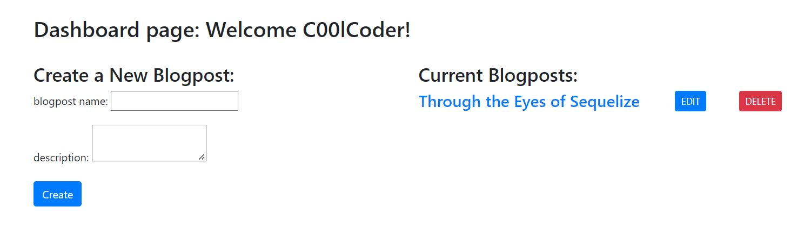

# Confer the Code
All coding thoughts and opinions: Gather here with this tech blog!

## Table of Contents

- [Description](#description)
- [Deployed Application](#deployed-application)
- [Future Improvements](#future-improvements)
- [Usage](#usage)
- [Credits](#credits)
- [License](#license)

## Description

This is a blogging app focused on technology topics that allows users to create, edit and delete blogposts and comments. This full-stack app is built from scratch with the help of nodejs, express, sequelize, express-session, dotenv, connect-session-sequelize, and finally, the handlebars template engine on the front end.

## Deployed Application

This app is deployed to Heroku here: https://confer-the-code.herokuapp.com/

## Future Improvements

 * Adjust the blog comments functionality to allow users to edit or delete comments
 * Show which user commented with their username and the comment's timestamp
 * Updating blog posts isn't available for newly signed up users, just existing users
 * Always room for improvement on the UI!

## Usage

Below are screenshots of Confer the Code.

## Credits

List of resources used:

https://sequelize.org/docs/v6/core-concepts/model-basics/

https://sebhastian.com/sequelize-date-format/

https://www.npmjs.com/package/express-session

https://www.npmjs.com/package/bcrypt

https://www.npmjs.com/package/connect-session-sequelize

https://sebhastian.com/mysql-error-1452/

https://javascript.plainenglish.io/password-encryption-using-bcrypt-sequelize-and-nodejs-fb9198634ee7

https://coding-boot-camp.github.io/full-stack/heroku/deploy-with-heroku-and-mysql

https://www.hostinger.com/tutorials/how-to-fix-400-bad-request-error#:~:text=The%20HTTP%20status%20400%20%E2%80%93%20bad,framing%2C%20or%20deceptive%20request%20routing.

https://www.youtube.com/watch?v=HxJzZ7fmUDQ&ab_channel=WaelYasmina

https://getbootstrap.com/docs/5.2/forms/form-control/

https://stackoverflow.com/questions/901115/how-can-i-get-query-string-values-in-javascript

https://developer.mozilla.org/en-US/docs/Web/JavaScript/Reference/Global_Objects/parseInt

https://mysql.jawsdb.com/resource/dashboard

## License

No licenses (default copyright laws apply).

---